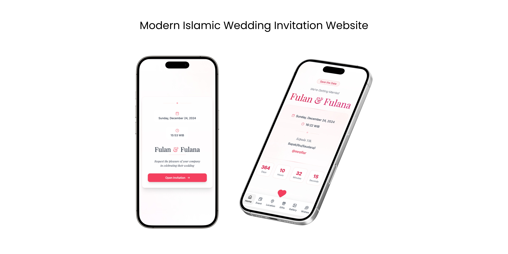

# Sakeenah: Modern Islamic Wedding Invitation



A modern, interactive wedding invitation website built with Vite (React), Tailwind CSS, and Framer Motion. Created by [@mrofisr](https://github.com/mrofisr).

## Features
- Modern design & smooth animations
- Fully responsive & mobile-first layout
- Background music & interactive wishes (WIP)
- Fun confetti effects and countdown timer
- Google Maps integration
- Digital envelope/gift feature with bank account details
- Multiple event agenda support

## Tech Stack
- [Vite (React)](https://vite.dev/)
- [Tailwind CSS](https://tailwindcss.com/)
- [Framer Motion](https://www.framer.com/motion/)
- [Lucide Icons](https://lucide.dev/)
- [React Confetti](https://www.npmjs.com/package/react-confetti)

## Installation
1. Clone the repository and install dependencies:
  ```bash
  git clone https://github.com/mrofisr/islamic-wedding-invitation
  cd islamic-wedding-invitation
  bun install
  ```
2. Update your wedding details in `src/config.js`.
3. Start the development server:
  ```bash
  bun run dev
  ```
  Open [http://localhost:5173/](http://localhost:5173/) in your browser.

## Customization

### Basic Setup
Edit `src/config.js` to customize your wedding invitation. Here's what you can configure:

#### Wedding Information
```javascript
const config = {
  data: {
    // Main invitation title that appears on the page
    title: "Pernikahan Fulan & Fulana",
    
    // Opening message/description of the invitation
    description: "Kami akan menikah dan mengundang Anda untuk turut merayakan momen istimewa ini.",
    
    // Groom's and bride's names
    groomName: "Fulan",
    brideName: "Fulana",
    
    // Parents' names
    parentGroom: "Bapak Groom & Ibu Groom",
    parentBride: "Bapak Bride & Ibu Bride",
```

#### Date, Time & Location
```javascript
    // Wedding date (format: YYYY-MM-DD)
    date: "2024-12-24",
    
    // Event time (free format, example: "10:00 - 12:00 WIB")
    time: "16:16 - 17:30 WIB",
    
    // Venue/building name
    location: "Grand Ballroom, Hotel Majesty",
    
    // Full address of the wedding venue
    address: "Jl. Jend. Sudirman No.1, Jakarta",
```

#### Google Maps Integration
```javascript
    // Google Maps link for location (short clickable link)
    maps_url: "https://goo.gl/maps/abcdef",
    
    // Google Maps embed code to display map on website
    // How to get: open Google Maps → select location → Share → Embed → copy link
    maps_embed: "https://www.google.com/maps/embed?pb=...",
```

#### Event Agenda
```javascript
    // List of event agenda/schedule
    agenda: [
      {
        // Event name
        title: "Akad Nikah",
        // Event date (format: YYYY-MM-DD)
        date: "2024-12-24",
        // Start time (format: HH:MM)
        startTime: "16:16",
        // End time (format: HH:MM)
        endTime: "17:30",
        // Event venue
        location: "Grand Ballroom, Hotel Majesty",
        // Full address
        address: "Jl. Jend. Sudirman No.1, Jakarta",
      },
      // You can add more agenda items with the same format
    ],
```

#### Background Music
```javascript
    // Background music settings
    audio: {
      // Music file (choose one or replace with your own file)
      src: "/audio/fulfilling-humming.mp3", // or /audio/nature-sound.mp3
      // Music title to display
      title: "Fulfilling Humming",
      // Whether music plays automatically when website opens
      autoplay: true,
      // Whether music repeats continuously
      loop: true
    },
```

#### Digital Envelope/Gift
```javascript
    // List of bank accounts for digital envelope/gifts
    banks: [
      {
        // Bank name
        bank: "Bank Central Asia",
        // Account number
        accountNumber: "1234567890",
        // Account holder name (all uppercase)
        accountName: "FULAN",
      },
      // You can add more banks with the same format
    ]
```

#### SEO & Branding
```javascript
    // Image that appears when link is shared on social media
    ogImage: "/images/og-image.jpg",
    
    // Icon that appears in browser tab
    favicon: "/images/favicon.ico",
```

### Complete Configuration Example
```javascript
const config = {
  data: {
    title: "Pernikahan Fulan & Fulana",
    description: "Kami akan menikah dan mengundang Anda untuk turut merayakan momen istimewa ini.",
    groomName: "Fulan",
    brideName: "Fulana",
    parentGroom: "Bapak Groom & Ibu Groom",
    parentBride: "Bapak Bride & Ibu Bride",
    date: "2024-12-24",
    maps_url: "https://goo.gl/maps/abcdef",
    maps_embed: "https://www.google.com/maps/embed?pb=!1m18!1m12!1m3!1d3966.0000000000005!2d106.8270733147699!3d-6.175392995514422!2m3!1f0!2f0!3f0!3m2!1i1024!2i768!4f13.1!3m3!1m2!1s0x2e69f4f1b6d7b1e7%3A0x2e69f4f1b6d7b1e7!2sMonumen%20Nasional!5e0!3m2!1sid!2sid!4v1633666820004!5m2!1sid!2sid",
    time: "16:16 - 17:30 WIB",
    location: "Grand Ballroom, Hotel Majesty",
    address: "Jl. Jend. Sudirman No.1, Jakarta",
    ogImage: "/images/og-image.jpg",
    favicon: "/images/favicon.ico",
    agenda: [
      {
        title: "Akad Nikah",
        date: "2024-12-24",
        startTime: "16:16",
        endTime: "17:30",
        location: "Grand Ballroom, Hotel Majesty",
        address: "Jl. Jend. Sudirman No.1, Jakarta",
      },
      {
        title: "Resepsi Nikah",
        date: "2024-12-24",
        startTime: "16:16",
        endTime: "17:30",
        location: "Grand Ballroom, Hotel Majesty",
        address: "Jl. Jend. Sudirman No.1, Jakarta",
      }
    ],
    audio: {
      src: "/audio/fulfilling-humming.mp3",
      title: "Fulfilling Humming",
      autoplay: true,
      loop: true
    },
    banks: [
      {
        bank: "Bank Central Asia",
        accountNumber: "1234567890",
        accountName: "FULAN",
      },
      {
        bank: "Bank Mandiri",
        accountNumber: "0987654321",
        accountName: "FULANA",
      }
    ]
  }
};

export default config;
```
## Custom Wedding Invitation Service

### 💝 Want This Invitation Made for You?

If you're interested in having a custom wedding invitation created using this template, please note our terms:

**Requirements:**
- You must agree with the concept and design philosophy provided
- Willing to donate a portion of the service fee to mosques or charitable institutions in need
- Respect the Islamic values and aesthetic principles embedded in the design

This approach ensures that every wedding invitation created not only celebrates your special day but also contributes to the community and upholds the values of giving back.


*"And whoever does good - whether male or female - and is a believer, they will enter Paradise and will not be wronged even as much as the speck on a date seed."* - Quran 4:124

## License
This project is licensed under the [Apache License 2.0](https://opensource.org/licenses/Apache-2.0). You can use, modify, and distribute it as long as you include the original copyright notice and license.

## Contributing & Support
Contributions and issue reports are welcome. If this project helped you, give it a ⭐️!

## Contact
- GitHub: [@mrofisr](https://github.com/mrofisr)
- Instagram: [@mrofisr](https://instagram.com/mrofisr)

May Allah guide us all.